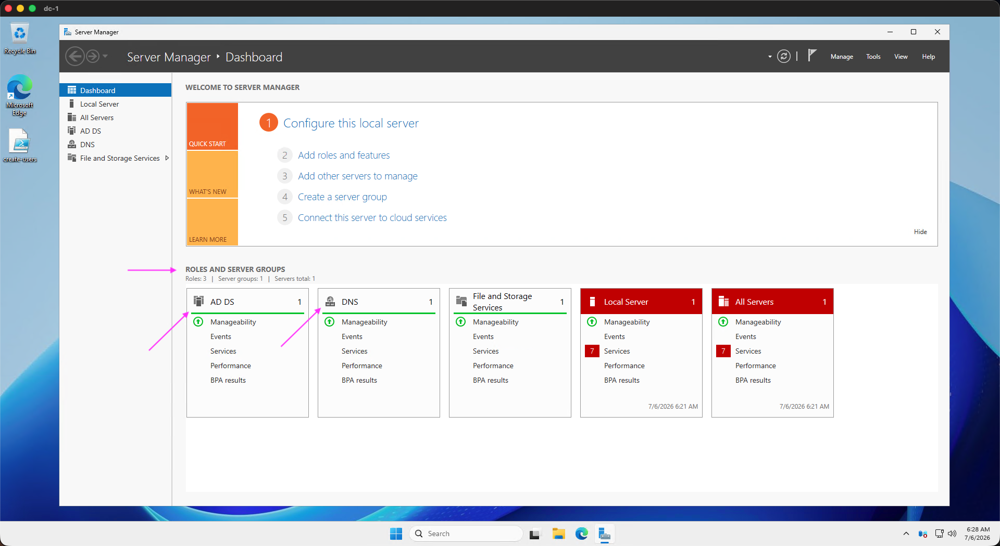
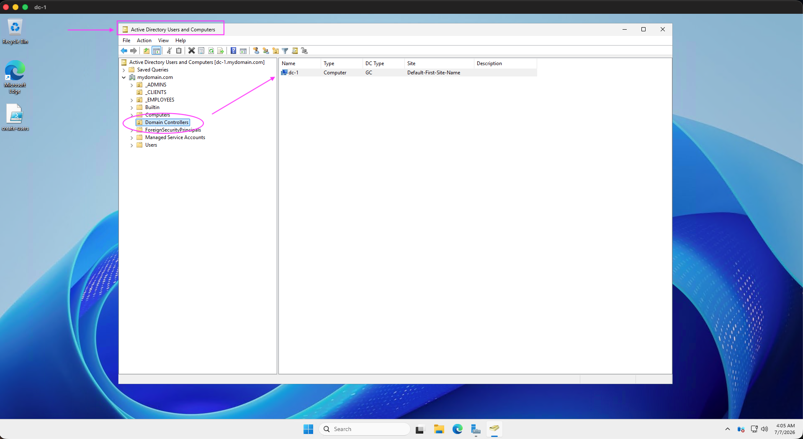
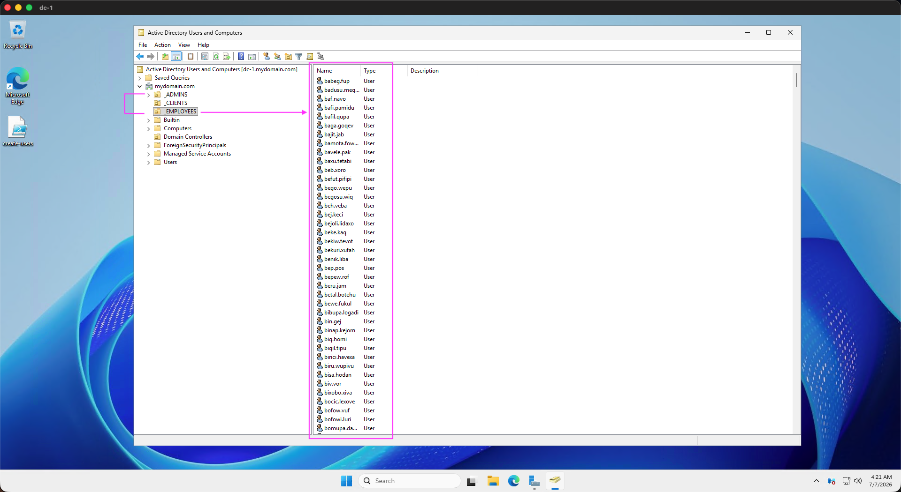
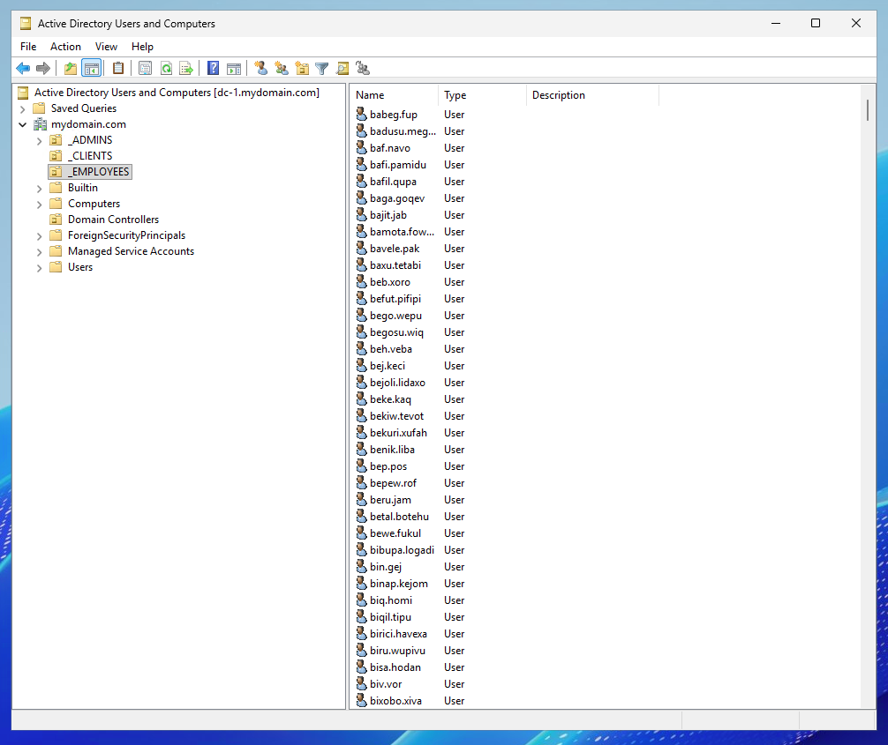

  

# Active Directory Domain Services (AD DS) Deployment

# Configuring On-premises Active Directory within Azure VMs

## Project Overview
This project demonstrates the deployment of a functional Active Directory Domain Services (AD DS) environment within a Microsoft Azure virtual network. The goal was to simulate an enterprise-level identity management infrastructure in a hybrid cloud environment.

## Key Skills Demonstrated
- **Active Directory Domain Services (AD DS):** Managed users and groups.
- **Azure Networking:** Configured Virtual Networks (VNet) and subnets.
- **Windows Server Administration:** Installed and promoted a server to a Domain Controller.
- **Infrastructure Troubleshooting:** Validated domain connectivity and DNS resolution.

## Implementation Steps
1. Created an Azure Virtual Network.
2. Deployed a Windows Server Virtual Machine.
3. Installed and configured Active Directory Domain Services.
4. Promoted the server to a Domain Controller.
5. User Management: Created Organizational Units (OU) and added test user accounts to verify proper authentication.

 

*Figure 1: Creation of Azure Resource Group architecture containing the Domain Controller (dc-1) and Client VM (Client-1), providing an organized foundation for the domain environment.*

*Figure 1(a): Close up of Overview of Resource group .*

---

*Figure 2: (Click to Enlarge) Verifying DNS connectivity from the Client VM. The 'ipconfig /all' output confirms the primary DNS server correctly points to the Domain Controller’s private IP address, enabling domain name resolution.*

---

*Figure 3: (Click to Enlarge) Server Manager dashboard showing successful deployment and operational status of Active Directory Domain Services (AD DS) and DNS.. (Note: Minor status alerts in 'Local Server' are standard for an isolated lab VM environment and do not impact core functionality.*

---

*Figure 4: (Click to Enlarge) Active Directory Users and Computers (ADUC) confirming the server is recognized as a Domain Controller within the domain hierarchy.*

---

**5. User Management & Authentication**

*Figure 5: Organizational Unit (OU) structure and user management. Implementation of segregated OUs (Admins, Clients, Employees). Automated population of 1,000 test user accounts using Powershell Script to simulate a production-scale environment.*

**5(a). User Management & Authentication**

*Figure 5(a): Close up view of structure.*

